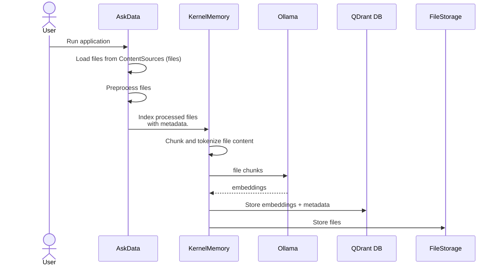

# AskData

## Indexation Workflow

```mermaid
sequenceDiagram
    actor User
    participant AskData
    participant KernelMemory
    participant Ollama
    participant QDrant as QDrant DB
    participant FileStorage

    User->>AskData: Run application
    AskData->>AskData: Load files from ContentSources (files)
    AskData->>AskData: Preprocess files
    AskData->>KernelMemory: Index processed files<br>with metadata.
    KernelMemory->>KernelMemory: Chunk and tokenize file content
    KernelMemory->>Ollama: file chunks
    Ollama-->>KernelMemory: embeddings
    KernelMemory->>QDrant: Store embeddings + metadata
    KernelMemory->>FileStorage: Store files
```
