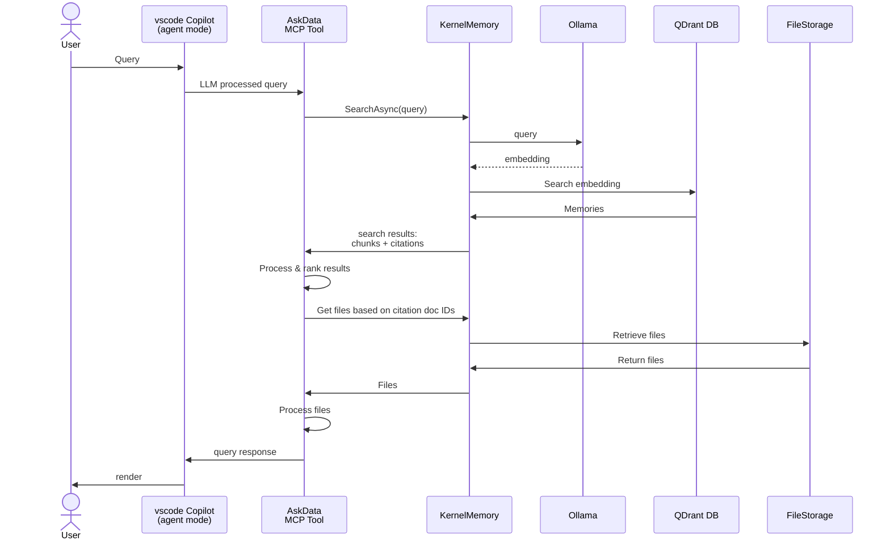

# AskData.MCP RAG

## Semantic/Vector Search

```mermaid
sequenceDiagram
    actor User
    participant vscode as vscode Copilot<br>(agent mode)
    participant AskData as AskData<br> MCP Tool
    participant KernelMemory
    participant Ollama
    participant QDrant as QDrant DB
    participant FileStorage

    User->>vscode: Query
    vscode->>AskData: LLM processed query
    AskData->>KernelMemory: SearchAsync(query)
    KernelMemory->>Ollama: query
    Ollama-->>KernelMemory: embedding
    KernelMemory->>QDrant: Search embedding
    QDrant->>KernelMemory: Memories
    KernelMemory->>AskData: search results:<br>chunks + citations
    AskData->>AskData: Process & rank results
    AskData->>KernelMemory: Get files based on citation doc IDs
    KernelMemory->>FileStorage: Retrieve files
    FileStorage->>KernelMemory: Return files
    KernelMemory->>AskData: Files
    AskData->>AskData: Process files
    AskData->>vscode: query response
    vscode->>User: render
```
